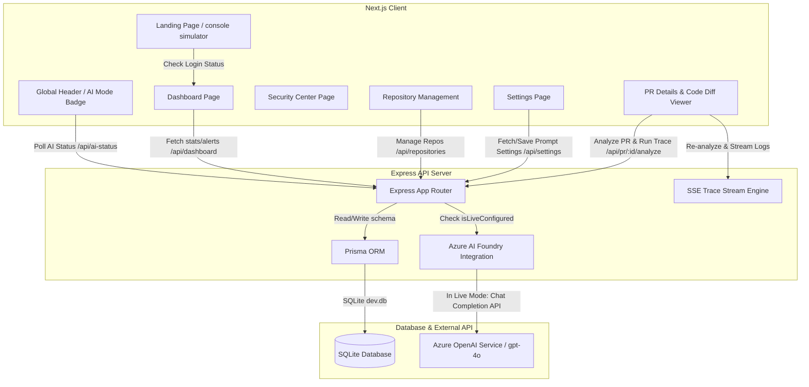

# ReviewAgent AI: AI-powered Pull Request Security Auditor

This document provides a comprehensive technical overview of the architecture, features, data models, and workflows implemented in the **ReviewAgent AI** project (both Frontend and Backend). You can use this content to build your PPT, architectural diagrams, and project reviews.

---

## 1. Project Overview & Core Value Prop
**ReviewAgent AI** is a Security Review Assistant designed to perform Reasoning-Based Code Reviews directly on pull requests in the CI/CD pipeline. 
* **Zero-Setup Demo Mode**: Works out of the box using structured, realistic mock traces and findings when API keys are absent or configured with default placeholders.
* **Instant Live Upgrade**: Automatically transitions to **Live AI Mode** using **Azure AI Foundry / OpenAI Service** (`gpt-4o`) once valid credentials are provided in `.env`, without needing frontend changes.

---

## 2. System Architecture



---

## 3. Database Schema Design (SQLite via Prisma)

The database layers are structured using a relational model to manage repositories, PRs, security findings, and settings:

```prisma
// --- prisma/schema.prisma ---

model Repository {
  id           Int      @id @default(autoincrement())
  name         String   @unique
  githubUrl    String?
  status       String   // "Connected", "Action Required"
  analyzedPrs  Int      @default(0)
  lastSync     String   // e.g., "Just now"
  error        String?
  
  pullRequests PullRequest[]
}

model PullRequest {
  id              Int      @id @default(autoincrement())
  repoId          Int
  prNumber        Int
  title           String
  author          String
  status          String   // "Completed", "Reviewing", "Flagged"
  risk            String?  // "High", "Critical", "Low"
  time            String   // e.g. "1 hour ago"
  createdAt       DateTime @default(now())
  riskScore       Int?
  aiSummary       String?
  confidenceScore Int?

  repo      Repository @relation(fields: [repoId], references: [id])
  findings  Finding[]
}

model Finding {
  id            Int      @id @default(autoincrement())
  prId          Int
  severity      String   // "Critical", "High", "Medium", "Low"
  category      String   // "Security", "Performance", "Logic", "Style"
  fileName      String?
  lineNumber    Int?
  description   String
  fixSuggestion String?  // Code snippet for remediation

  pullRequest   PullRequest @relation(fields: [prId], references: [id])
}

model Setting {
  id        Int      @id @default(autoincrement())
  key       String   @unique
  value     String   // System prompts configuration
  updatedAt DateTime @updatedAt
}
```

---

## 4. Frontend Features & Premium Aesthetics

The frontend is built on **Next.js** using **React, TailwindCSS (configured with shadcn components), and Framer Motion**:
* **Animations & Styling**: Implements modern glassmorphic layouts, neon borders, and dynamic gradients. Custom global themes enable dark mode styling.
* **Interactive Landing Page**: A gorgeous entrance featuring a hero title banner, an interactive live-simulating mock command terminal showing automated security reviews, benefit/metrics cards, and a direct entrance path to the app.
* **AI Status Header Badge**:
  * Displays **Demo Mode** (Purple badge) when placeholders exist.
  * Displays **Live AI Mode** (Green pulsing badge) when real Azure credentials are set.
* **Dashboard Insights**: Displays catch statistics, PR analytics charts, and a notification dropdown showing recent critical vulnerabilities with immediate navigation links.
* **PR Analysis Center**:
  * Interactive code diff highlighting.
  * Security findings panels grouped by severity.
  * Code remediations showing side-by-side diffs with a one-click **Copy Fix** utility.
  * Interactive buttons to **Re-run Analysis** or **Approve Fixes**.
* **AI Trace Console**: Real-time SSE stream renderer showing step-by-step thoughts of the AI agent as it analyzes code changes.

---

## 5. Backend Services & AI Core

The backend is built using **Express.js and tsx (TypeScript execute)**:
* **Dual AI Architecture Router**: 
  * Integrates the helper `isLiveConfigured()` to safely isolate environment configuration.
  * Strips out developer placeholders like `<your-` in the `.env` variables to prevent system crashes and guarantee immediate fallback to Demo Mode.
* **Azure AI Foundry Client**:
  * Utilizes `openai` Node SDK configured for `AzureOpenAI`.
  * Dynamically instances client configuration:
    * `AZURE_OPENAI_ENDPOINT`
    * `AZURE_OPENAI_API_KEY`
    * `AZURE_OPENAI_DEPLOYMENT_NAME`
  * Prompts the model to return a strictly typed **JSON Object** schema matching findings and overall risk score, keeping the process reliable and automated.
* **Trace Streaming**: Serves dynamic log messages to the frontend via a persistent Server-Sent Events (SSE) route, adjusting traces based on the current mode (showing mock logic thoughts vs live API connection points).

---

## 6. End-to-End Workflow

```
[ Developer creates PR / connects Repository ]
                    │
                    ▼
[ Client sends POST request to /api/pr/:id/analyze ]
                    │
                    ▼
[ Backend detects environment mode using isLiveConfigured() ]
        ├── Demo Mode ────► Load Mock diff patterns & simulated agent traces
        └── Live AI Mode ──► Send diff payload to Azure OpenAI (gpt-4o)
                    │
                    ▼
[ Backend parses findings JSON -> Saves to SQLite DB -> Updates PR Risk Score ]
                    │
                    ▼
[ Frontend visualizes findings, highlights lines, and offers remediation fixes ]
```

---

## 7. Recommended PPT Structure (Slides outline)

Use these 6 slides for a high-impact presentation:

* **Slide 1: Title & Elevator Pitch**
  * *Title*: ReviewAgent AI: AI-powered Pull Request Security Auditor
  * *Subtitle*: Scaling code review and vulnerability detection in real-time.
* **Slide 2: The Problem & Solution**
  * *Problems*: Vulnerabilities slip through PRs; manual code reviews are slow and costly.
  * *Solution*: An automated AI reviewer running in the pipeline with zero-config (Demo Mode) and instant enterprise capability (Azure AI Foundry).
* **Slide 3: Architecture & Tech Stack**
  * *Frontend*: Next.js, Framer Motion, Tailwind CSS
  * *Backend*: Node.js/Express, Prisma ORM, SQLite
  * *AI Engine*: Azure OpenAI (gpt-4o) client cache
* **Slide 4: Dual AI Mode (Engineering Highlight)**
  * Details how the app uses placeholder filtering to run safely in local mock demo mode out-of-the-box and automatically upgrades to live completions once environment keys are verified.
* **Slide 5: Key Workflows & UI Highlights**
  * Highlights of the Code Diff Viewer, One-Click Remediation Copy, Live AI Traces Console, and Security Metrics Center.
* **Slide 6: Conclusion & Next Steps**
  * Outlines immediate scalability: GitHub Webhooks, automated inline PR comments, and expanded rulesets.
