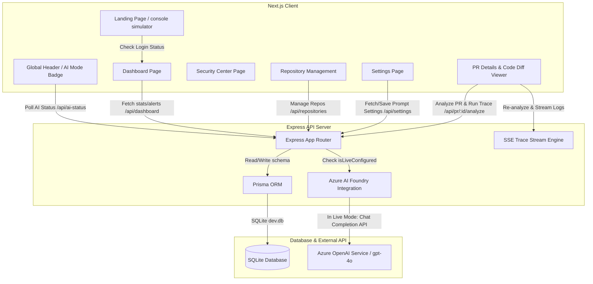

# ReviewAgent AI: AI-powered Pull Request Security Auditor

ReviewAgent AI is a Security Review Assistant designed to perform Reasoning-Based Code Reviews directly on pull requests. By scanning code diffs, identifying security vulnerabilities, and evaluating logic flows, it provides clear risk assessments, confidence scoring, analysis workflows with reasoning traces, and suggested fixes with side-by-side code remediations.

---

## 🚀 Key Features

* **Pull Request Analysis**: Automated inspection of changed code files in unified diff format to capture logical flows and potential design improvements.
* **Security Vulnerability Detection**: Detects common security flaws such as SQL Injection, hardcoded secrets, memory leaks, and input sanitization gaps.
* **Risk Assessment & Confidence Scoring**: Computes a dynamic risk score (0-100) and an intelligence confidence score representing the certainty of the findings.
* **Analysis Workflow & Reasoning Trace**: Visualizes the step-by-step reasoning trace of the review assistant in real-time as it executes auditing checks, served via a Server-Sent Events (SSE) stream.
* **Suggested Fixes**: Provides actionable, side-by-side code remediation suggestions with a one-click copy utility for rapid developer feedback.
* **Security Center Dashboard**: Displays analytics trends, vulnerability categories, critical alerts, and active repositories to give security teams clear visibility.
* **Dual AI Execution Modes**:
  * **Zero-Setup Demo Mode**: Works out of the box using structured, realistic mock traces and findings when API keys are absent or configured with default placeholders.
  * **Instant Live Upgrade**: Automatically transitions to **Live AI Mode** using **Azure OpenAI Service / Azure AI Foundry** (`gpt-4o`) once valid credentials are provided in `.env`, without needing frontend changes.

---

## 🏛️ System Architecture

ReviewAgent AI separates frontend presentation from backend auditing logic:



---

## 📸 Screenshots (Placeholders)

* **Landing Page**: *[Insert landing page mockup / screenshot showing console simulator]*
* **Dashboard**: *[Insert dashboard analytics and repository view screenshot]*
* **Repository Management**: *[Insert repository connection page screenshot]*
* **PR Analysis**: *[Insert pull request details and code diff view screenshot]*
* **Security Findings**: *[Insert vulnerability breakdown panel and suggested fixes screenshot]*
* **Security Center**: *[Insert security overview and intelligence stats dashboard screenshot]*

---

## 🛠️ Tech Stack

### Frontend
* **Framework**: Next.js 16.2.9 (Turbopack)
* **Styling**: Tailwind CSS & Base UI / shadcn components
* **Animations**: Framer Motion & CSS Micro-animations
* **Data Visualization**: Recharts

### Backend & Database
* **Server**: Express.js with tsx (TypeScript Execute)
* **ORM**: Prisma ORM
* **Database**: SQLite (local `dev.db` storage)
* **AI Integration**: Azure OpenAI Client via `openai` Node SDK

---

## 📁 Repository Structure

```
ReviewAgent AI/
├── PROJECT_SUMMARY.md       # Project summary & design architecture overview
├── README.md                # Project documentation (this file)
├── backend/                 # Express Server & Database
│   ├── prisma/              # Prisma Schemas & migrations
│   │   ├── dev.db           # SQLite database file
│   │   ├── schema.prisma    # Database schemas (Repository, PullRequest, etc.)
│   │   └── seed.ts          # Seed script for initial DB setup
│   ├── src/                 # Backend source code
│   │   ├── server.ts        # Express app and endpoint handlers
│   │   └── lib/             # Azure AI Foundry & integration utilities
│   ├── package.json
│   └── tsconfig.json
└── frontend/                # Next.js Web App
    ├── public/              # Static assets
    ├── src/                 # Frontend source code
    │   ├── app/             # Next.js App Router (Landing, Dashboard, PR details, Settings)
    │   ├── components/      # UI components (Diff Viewer, Stats cards, Charts)
    │   └── styles/          # Styling rules & Tailwind config
    ├── package.json
    └── tsconfig.json
```

---

## ⚙️ Configuration & Setup

Both components run independently and communicate via local HTTP REST/SSE protocols.

### 1. Database Setup (Backend)
The SQLite database file `dev.db` is already initialized. If you ever need to reset or regenerate the client, navigate to the `backend` directory and run:
```bash
npx prisma generate
npx prisma db push
npm run seed
```

### 2. Environment Variables (Backend)
Create or check the `backend/.env` file. It contains configuration for your Azure OpenAI credentials:
```env
DATABASE_URL="file:./dev.db"
AZURE_OPENAI_ENDPOINT="https://<your-resource-name>.openai.azure.com/"
AZURE_OPENAI_API_KEY="<your-azure-api-key>"
AZURE_OPENAI_DEPLOYMENT_NAME="<your-model-deployment-name>"
```
*If left as default `<your-...>` placeholders, the backend automatically logs a warning and falls back safely to **Demo Mode**.*

---

## 🏃 Running the Project

Ensure you have Node.js (v18+) installed.

### Start the Backend
Navigate to the `backend` directory and run:
```bash
cd backend
npm install
npm run dev
```
*The backend server will start at **http://localhost:3001**.*

### Start the Frontend
Navigate to the `frontend` directory and run:
```bash
cd frontend
npm install
npm run dev
```
*The frontend development server will start at **http://localhost:3000**.*

---

## 📊 Database Schema Design

```prisma
model Repository {
  id           Int           @id @default(autoincrement())
  name         String        @unique
  githubUrl    String?
  status       String        // "Connected", "Action Required"
  analyzedPrs  Int           @default(0)
  lastSync     String        // Last sync indicator
  pullRequests PullRequest[]
}

model PullRequest {
  id              Int       @id @default(autoincrement())
  repoId          Int
  prNumber        Int
  title           String
  author          String
  status          String    // "Completed", "Reviewing", "Flagged"
  risk            String?   // "High", "Critical", "Low"
  time            String
  createdAt       DateTime  @default(now())
  riskScore       Int?
  aiSummary       String?
  confidenceScore Int?
  repo            Repository @relation(fields: [repoId], references: [id])
  findings        Finding[]
}

model Finding {
  id            Int         @id @default(autoincrement())
  prId          Int
  severity      String      // "Critical", "High", "Medium", "Low"
  category      String      // "Security", "Performance", "Logic", "Style"
  fileName      String?
  lineNumber    Int?
  description   String
  fixSuggestion String?     // Code snippet for remediation
  pullRequest   PullRequest @relation(fields: [prId], references: [id])
}

model Setting {
  id        Int      @id @default(autoincrement())
  key       String   @unique
  value     String
  updatedAt DateTime @updatedAt
}
```
